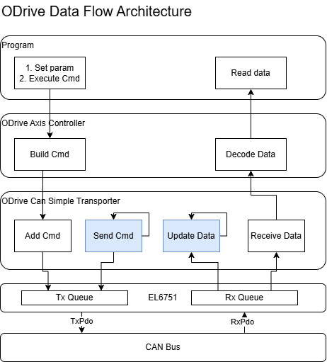
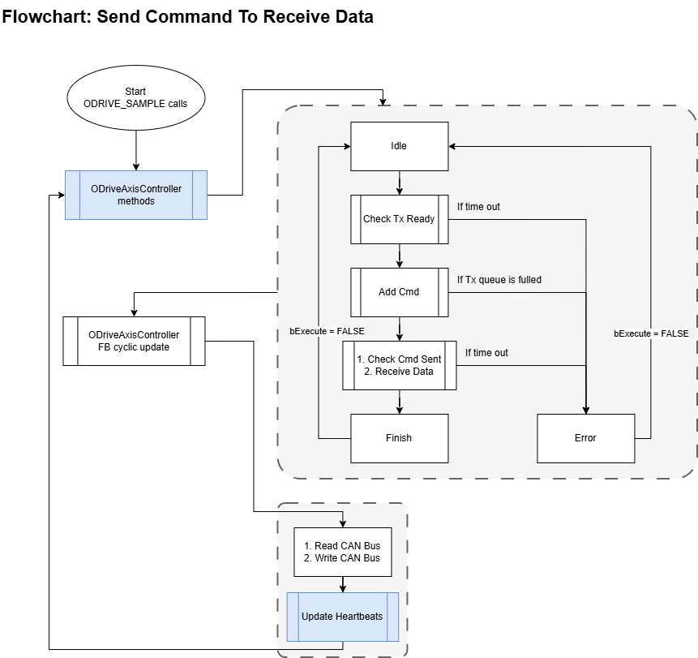

# ODrive CAN Interface Architecture

本文件說明此專案在 TwinCAT PLC 中如何透過 CAN Simple 協定與 ODrive 通訊，並整理目前程式中的主要模組、資料流向，以及單次命令從送出到收到資料的執行流程。

此專案的核心設計分成兩層：

- `ODriveAxisController`：對上層程式提供命令與資料讀取介面。
- `ODriveCanSimpleTransporter`：對底層 EL6751 CAN queue 與 CAN bus 進行收發。

上層程式不會直接對 CAN bus 操作，而是透過 controller 建立命令，再由 transporter 將封包送入 Tx queue，最後從 Rx queue 取回資料並交由 controller 解碼與更新狀態。

## 整體資料流架構

這張圖描述的是專案內部各層之間的責任分工，以及資料如何在 PLC、EL6751 與 ODrive 之間流動。

### 上層程式

`Program` 代表使用者在 PLC task 中撰寫的應用程式，例如 `ODRIVE_SAMPLE`。上層程式會呼叫 `ODriveAxisController` 的 methods，例如：

- `ClearErrors`
- `SetControllerMode`
- `SetAxisState`
- `SetInputPos`
- `GetEncoderEstimates`
- `GetError`

這一層負責決定何時送出命令、何時讀取狀態，以及如何處理 `bBusy`、`bDone`、`bError` 等控制訊號。

### ODriveAxisController

`ODriveAxisController` 是對上層暴露的主要功能區塊。它負責：

- 根據 method 輸入組出對應的 CAN message。
- 管理命令執行流程，例如等待 Tx ready、加入命令、等待傳送完成、等待回覆資料。
- 呼叫 transporter 存取 Tx/Rx queue。
- 將接收到的 CAN payload 解碼成結構化資料。
- 維護自動 heartbeat 狀態，例如 `stAutoHeartBeat`、`bAutoHeartBeatValid`、`bAutoHeartBeatUpdated`、`bAutoHeartBeatTimedOut`。

因此，`ODriveAxisController` 可視為「命令語意層 + 狀態管理層」，讓上層程式不需要直接處理 queue 細節或 CAN frame 解析。

### ODriveCanSimpleTransporter

`ODriveCanSimpleTransporter` 是傳輸層，負責：

- 將待送命令加入 Tx queue。
- 透過 `%Q*` / `%I*` 對映 EL6751 的 queue 結構。
- 在 cyclic scan 中持續檢查 Tx queue 與 Rx queue。
- 判斷目前是否已完成傳送。
- 從 Rx queue 中找出符合 `NodeId` 與 command 的回覆封包。

在實作上，它用 `ST_CanQueue` 對應 EL6751 的資料結構，並以 `TxCounter` / `RxCounter` 與 `NoOfMessages` 控制命令是否已經送出與收妥。

### EL6751 與 CAN bus

`EL6751` 是 PLC 與實體 CAN bus 之間的橋接裝置。專案內的 transporter 透過 EL6751 queue 進行資料交換：

- Tx 路徑：PLC 將命令寫入 queue，等待 EL6751 送上 CAN bus。
- Rx 路徑：EL6751 將收到的 CAN frame 寫回 queue，PLC 再循環讀取。

因此整體資料流不是同步的函式呼叫，而是依賴 PLC cyclic task 持續掃描、送出與收回資料。

## 命令送出到接收資料的流程

這張圖描述的是單次命令的生命週期，也就是上層程式如何透過 `ODriveAxisController` 從發命令一路走到收到回應。

### 1. 上層程式觸發 method

流程通常從 `ODRIVE_SAMPLE` 或其他應用程式開始。當上層程式呼叫 `ODriveAxisController` 的某個 method，controller 會根據輸入參數準備命令內容，並進入自己的 state machine。

這裡的關鍵不是「呼叫一次 method 就完成」，而是「method 在每個 scan 中推進一次狀態」。因此上層程式必須持續呼叫同一個 FB，直到 `bDone = TRUE` 或 `bError = TRUE`。

### 2. 檢查 Tx 是否可用

在正式加入命令前，controller 會先檢查 transporter 是否處於可送狀態。實作中會透過 `IsTxDone()` 判斷目前是否沒有尚未完成的傳送工作。

若 Tx 遲遲無法進入可送狀態，流程會依 timeout 設定轉入 error path。這可避免 queue 卡住時讓上層邏輯無限等待。

### 3. 建立並加入命令

當 Tx ready 後，controller 會組出對應的 `ST_CanMessage`：

- 設定 `CobId`
- 填入資料欄位 `Data[0..7]`
- 指定對應的 ODrive command

接著呼叫 transporter 的 `AddCmd()`，將命令放進 Tx queue。若 queue 已滿，流程會立即回報錯誤。

### 4. 由 cyclic update 實際收發 CAN 資料

命令加入 queue 之後，不代表封包已立即送出。真正的資料交換是在 cyclic scan 中由 `ODriveCanSimpleTransporter` 持續執行：

- 同步 EL6751 的 Rx counter
- 檢查 Tx queue 是否非空
- 若有待送命令，推進 `SendCmd()`
- 等待 EL6751 回報送出完成

因此命令送出與資料接收本質上是背景循環作業，而不是單一 blocking call。

### 5. 接收回覆並更新資料

當回覆封包進入 Rx queue 後，controller 會依 `NodeId` 與 command 找出對應訊息，並將 payload 解碼為可用資料，例如：

- heartbeat
- encoder estimates
- error status

這些解碼後的結果會回寫到對應輸出結構，讓上層程式在下一個 scan 讀取到最新狀態。

### 6. 完成或進入錯誤狀態

整個流程最後會落在兩種結果之一：

- 成功：`bDone = TRUE`
- 失敗：`bError = TRUE` 並提供 `sErrorMsg`

圖中的 error path 主要對應幾類情況：

- Tx ready timeout
- 命令送出 timeout
- 接收資料 timeout
- Tx queue 已滿

這些錯誤設計可讓上層程式明確知道失敗位置，而不是只看到無回應。

## 設計重點

### 非同步命令模型

此專案採用 PLC 常見的非同步命令模式，以 `bExecute`、`bBusy`、`bDone`、`bError` 來管理一次操作的生命週期。這讓命令處理可以和 cyclic task 一致整合，也比較容易處理 timeout 與錯誤狀態。

### 傳輸層與語意層分離

`ODriveAxisController` 處理 ODrive 指令語意與資料解碼，`ODriveCanSimpleTransporter` 處理 queue 與實體傳輸。這種分層讓上層 API 較乾淨，也降低 queue 細節滲入應用程式的風險。

### Heartbeat 與一般命令並行存在

除了一般命令外，controller 也會在 cyclic scan 中更新 heartbeat 狀態。這代表系統同時具備：

- 主動送命令的 request/response 路徑
- 被動接收 ODrive 周期性 heartbeat 的監測路徑

這兩條路徑都依賴相同的 cyclic 更新機制，因此 task 是否穩定執行會直接影響整體通訊可靠度。

### Queue 與 timeout 是主要邊界條件

實作中的主要邊界條件集中在兩類：

- queue 是否有空間、是否能正確清空
- 傳送與接收是否在預期時間內完成

若未來要擴充更多指令或節點，這兩部分仍會是最需要優先關注的穩定性重點。
